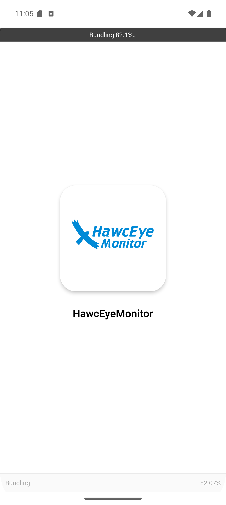
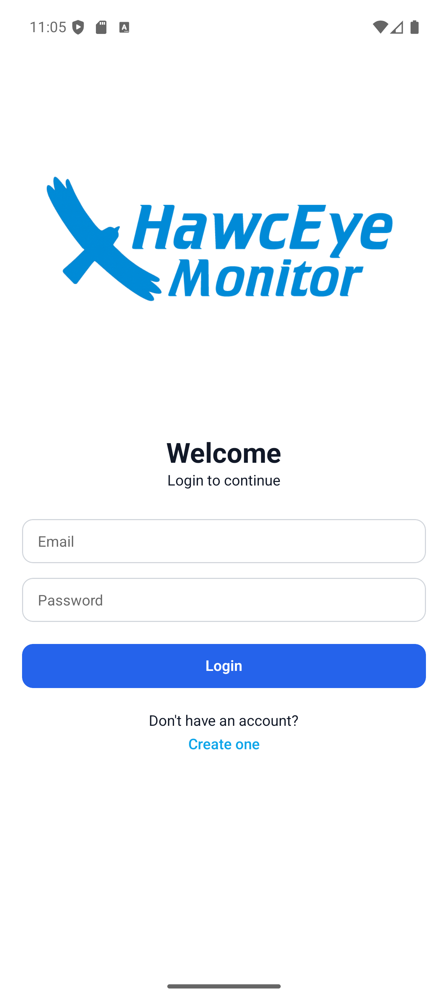
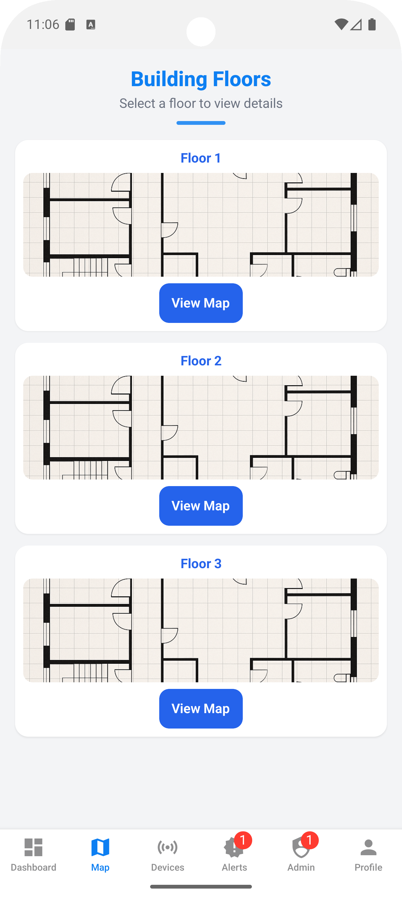
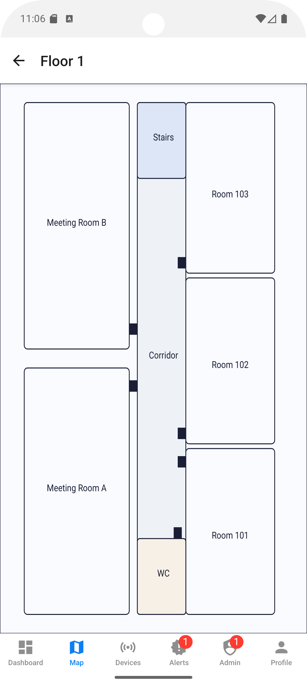
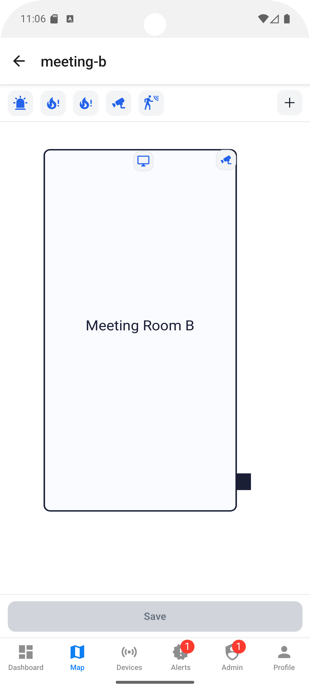

## HawcEyeMonitor

##
HawcEyeMonitor is an internal mobile application for Hawc Servers designed to manage and monitor devices inside the company building (cameras, sensors, displays, etc.). It provides location-based visualization, real-time status tracking, and efficient issue reporting and resolution.

## 🧭 What is this project?

HawcEyeMonitor is a mobile-first monitoring and management tool built with Expo React Native. It gives a centralized overview of all company devices, allowing users to see where each device is located, what its current status is, and whether any issues require attention.

## ⚙️ What does it do?

Dashboard: View the total number of devices and their current statuses.

Location-based view: Visualize devices by floors and rooms.

Issue management: Report problems, view details, and mark issues as resolved.

Device management (CRUD): Add, edit, delete devices, and update their locations.

Security & roles: Role-based access (Admin / Staff).

Realtime updates: Instant synchronization using Firebase Firestore.

## 🧑‍💼 User Roles

Admin: Manages users and access rights.

Staff: Monitors devices, reports issues, and updates statuses.

Note: After creating a user through the app, the role must be manually updated in Firestore (e.g., set role: "admin") to grant admin privileges.

## 🧩 Technologies

Expo React Native

TypeScript

Firebase Firestore (Realtime)

Firebase Authentication

(Optional / project-specific) React Navigation, react-native-svg, NativeWind

## 📦 Requirements

Node.js: v22.14.0

Expo Go on a physical device or an Android/iOS emulator (both supported)

A working Firebase project (Authentication + Firestore)

## ▶️ How to run locally

Run the following commands inside the project folder hawc-eye-monitor, in order:

npm install
npx expo start

Then:

Scan the QR code with Expo Go on your phone, or

Launch the app on an emulator.

## 🔐 Firebase Setup

The project uses Firebase Authentication for login.

It is connected to a real Firebase project (not the Emulator).

After creating a user:

Open Firestore → collection users → update the user role (e.g., role: "admin").

No .env configuration is required in the current setup.

## 🗂️ Data Structure (Overview)

devices: device data (name, status, location, issue details, etc.)

users: user information and role (Admin/Staff)

## 📸 Screenshots

## 📚 Repository

GitHub: https://github.com/GaithHogent/HawcEyeMonitor